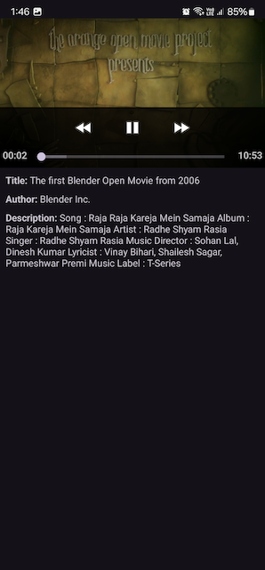
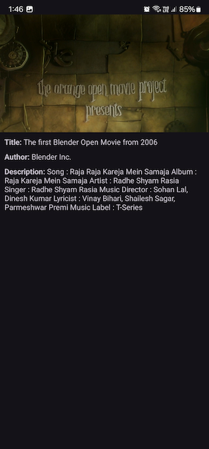

# Android Video Player App

Android Video Player App is a mobile application that allows users to watch videos stored locally or fetched from a remote server. The app utilizes native video player functionality along with Retrofit for network requests, Room for local database storage, coroutines for asynchronous programming, Glide for image loading, and version catalog for managing dependencies.

## Table of Contents

- [Introduction](#introduction)
- [Features](#features)
- [Demo](#demo)
- [Installation](#installation)
- [Usage](#usage)
- [Contributing](#contributing)
- [License](#license)

## Introduction

Android Video Player App provides users with a seamless video viewing experience on their Android devices. It allows users to watch videos both online and offline, with features for fetching and caching videos from a remote server.

## Features

- Native video player integration for smooth playback.
- Fetch videos from a remote server using Retrofit.
- Store fetched videos locally using Room database.
- Asynchronous programming with coroutines for improved performance.
- Load video thumbnails using Glide for efficient image loading.
- Manage dependencies using version catalog for easy maintenance.

## Demo





## Installation

To install the Android Video Player App, follow these steps:

1. Clone the repository:
   ```sh
   git clone https://github.com/username/android-video-player.git
2. Build the project using Android Studio Jellyfish | 2023.3.1


   
